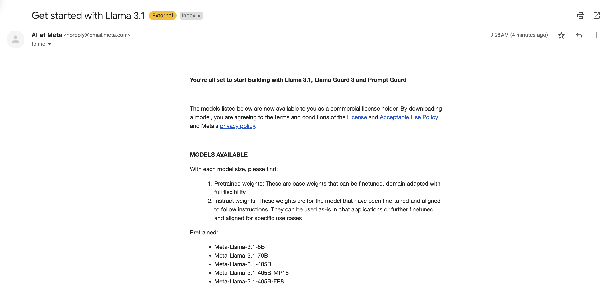
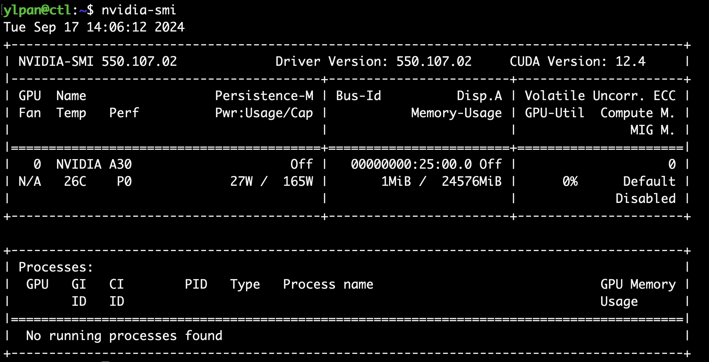

# Assignment 2: Instruction

**AMS560 - Fall 2024**  
**Professor:** Zhenhua Liu  
**Teaching Assistants:** Yunlong Pan & Xander Barron


## Requirements (100 points)

### Section 1: Download and run (75 points)

1. (15 points) Do you successfully set up a Cloudlab with GPU? (Yes or No and a screenshot)
2. (15 points) Do you successfully print the model list? (Yes or No and a screenshot)
3. (15 points) Do you successfully download the **Llama3.1-8B-Instruct** model? Where you download it? (Yes or No and a screenshot)
4. (15 points) Do you successfully install GPU driver? Show your GPU usage. (Yes or No and a screenshot)
5. (15 points) Do you successfully run the **example_chat_completion.py**? (Yes or No and three screenshots)

### Section 2: Explore (25 points)

1. (5 points) How many files in **/Llama3.1-8B-Instruct**? What are they?
2. (5 points) How many heads of each multi-head attention block?
3. (5 points) What's the tokenizer encode output of "hello world!"?
4. (5 points) How many transformer layers of this model?
5.  (5 points) What's the shape of Attention weight $W_o$ of layer 21?

### Section 3: External reading (Not required)

The Llama 3 Herd of Models

https://ai.meta.com/research/publications/the-llama-3-herd-of-models/

## Outline

- [Assignment 2: Instruction](#assignment-2-instruction)
  - [Requirements (100 points)](#requirements-100-points)
    - [Section 1: Download and run (75 points)](#section-1-download-and-run-75-points)
    - [Section 2: Explore (25 points)](#section-2-explore-25-points)
    - [Section 3: External reading (Not required)](#section-3-external-reading-not-required)
  - [Outline](#outline)
  - [1. Set up Cloudlab](#1-set-up-cloudlab)
  - [2. Request Access to Llama Models](#2-request-access-to-llama-models)
  - [3. Download the Llama Model](#3-download-the-llama-model)
  - [4. Install GPU Driver](#4-install-gpu-driver)
  - [5. Run Llama Model](#5-run-llama-model)
  - [6. Explore](#6-explore)
  - [](#)
- [Llama Models](#llama-models)
  - [Llama Models](#llama-models-1)
  - [Download](#download)
  - [Running the models](#running-the-models)
  - [Access to Hugging Face](#access-to-hugging-face)
  - [Installations](#installations)
  - [Responsible Use](#responsible-use)
  - [Issues](#issues)
  - [Questions](#questions)

## 1. Set up Cloudlab

- Profile: OpenStack
- Number of computer nodes: 0
- Hardware type(a GPU with at least 20GB RAM is required)
- Hardware type Example: Cloudlab Wisconsin->d7525 (For Q1, take a screenshot)


## 2. Request Access to Llama Models


- Llama: Download models https://llama.meta.com/
- You will get an email when you finish your request.




## 3. Download the Llama Model


- Follow the download instruction: https://github.com/yl1127/llama-models?tab=readme-ov-file#download
- Remember your download path. Example '/users/ylpan/.llama/checkpoints/Llama3.1-8B-Instruct'

```bash
pip install llama-toolchain

llama model list --show-all
# if llama: command not found, use the full path. Example:'/users/ylpan/.local/bin/llama model list --show-all'
# For Q2, take a screenshot

llama download --source meta --model-id Llama3.1-8B-Instruct
# We choose Llama3.1-8b-instruct
# For Q3, take a screenshot

# if llama: command not found, use the full path. Example:'/users/ylpan/.local/bin/llama download --source meta --model-id Llama3.1-8B-Instruct'

# Provide the signed URL you received via email
```


## 4. Install GPU Driver

- Check your Cloudlab hardware again. At least d7525(A30 with RAM 24 GB) is recommended.
- NVIDIA drivers installation https://ubuntu.com/server/docs/nvidia-drivers-installation
- Your system need some time to reboot.

```bash
sudo apt install ubuntu-drivers-common

sudo ubuntu-drivers list
# check if ubuntu-drivers install successfully

sudo ubuntu-drivers install

sudo reboot
# reboot the system after ubuntu-drivers install
# you will loss connection and this step need some time

# After reboot, reconnect with your system and check if NVIDIA drivers install successfully or not
nvidia-smi
# if error: NVIDIA-SMI has failed because it couldn't communicate with the NVIDIA driver. Make sure that the latest NVIDIA driver is installed and running. Try to repeat the above steps
# For Q4, take a screenshot
```




## 5. Run Llama Model

- Obtain the scripts from Llama github
- Follow the **Running the models** section https://github.com/yl1127/llama-models?tab=readme-ov-file#running-the-models
- Prepare python environment
- Run an example
- Three conversations from example scripts will show up if you run the example successfully.

```bash
git clone https://github.com/yl1127/llama-models.git

cd llama-models/

pip install -r requirements.txt 

pip install torch fairscale fire blobfile

nano run_example.sh
```

```bash
#!/bin/bash

CHECKPOINT_DIR=~/.llama/checkpoints/Llama3.1-8B-Instruct
PYTHONPATH=$(git rev-parse --show-toplevel) torchrun models/scripts/example_chat_completion.py $CHECKPOINT_DIR
```

```bash
chmod +x ./run_example.sh

./run_example.sh

# For Q5, take three screenshots.
```


## 6. Explore

- Install the python packages
- Explore the model you download
- Read and run the python file first
- Modify the python file to answer Q6-10

```bash
pip install sentencepiece tiktoken torch blobfile matplotlib
# Install the python packages

nano AMS560_HW2.py
# create a python file
python AMS560_HW2.py
# run it
```
This is your example python file. Read and run this first. Then finish your Q6-10 by modifying this.

```python
from pathlib import Path
import tiktoken
from tiktoken.load import load_tiktoken_bpe
import torch
import json
import matplotlib.pyplot as plt

path = "..."
# modify the path first (the path from Q3)
# For Q6, explore this path
# For Q7, explore 'params.json' file

tokenizer_path = path + "/tokenizer.model"
special_tokens = [
            "<|begin_of_text|>",
            "<|end_of_text|>",
            "<|reserved_special_token_0|>",
            "<|reserved_special_token_1|>",
            "<|reserved_special_token_2|>",
            "<|reserved_special_token_3|>",
            "<|start_header_id|>",
            "<|end_header_id|>",
            "<|reserved_special_token_4|>",
            "<|eot_id|>",  # end of turn
        ] + [f"<|reserved_special_token_{i}|>" for i in range(5, 256 - 5)]
mergeable_ranks = load_tiktoken_bpe(tokenizer_path)
tokenizer = tiktoken.Encoding(
    name=Path(tokenizer_path).name,
    pat_str=r"(?i:'s|'t|'re|'ve|'m|'ll|'d)|[^\r\n\p{L}\p{N}]?\p{L}+|\p{N}{1,3}| ?[^\s\p{L}\p{N}]+[\r\n]*|\s*[\r\n]+|\s+(?!\S)|\s+",
    mergeable_ranks=mergeable_ranks,
    special_tokens={token: len(mergeable_ranks) + i for i, token in enumerate(special_tokens)},
)

print(tokenizer.decode(tokenizer.encode("hello world!")))
# For Q8, print the tokenizer.encode() output

model = torch.load(path+"/consolidated.00.pth", weights_only=True)
print('This is the first 20 matrices weights:')
print(json.dumps(list(model.keys())[:20], indent=4))
# This show the first 20 matrices weights. 
# For Q9, show last 5 or them all.

print('This is the shape for feed forward weight W_2 of layer 0, ')
print(model["layers.0.feed_forward.w2.weight"].shape)
# For Q10, print the shape for attention W_o of layer 21.
```


---

# Llama Models

Llama is an accessible, open large language model (LLM) designed for developers, researchers, and businesses to build, experiment, and responsibly scale their generative AI ideas. Part of a foundational system, it serves as a bedrock for innovation in the global community. A few key aspects:
1. **Open access**: Easy accessibility to cutting-edge large language models, fostering collaboration and advancements among developers, researchers, and organizations
2. **Broad ecosystem**: Llama models have been downloaded hundreds of millions of times, there are thousands of community projects built on Llama and platform support is broad from cloud providers to startups - the world is building with Llama!
3. **Trust & safety**: Llama models are part of a comprehensive approach to trust and safety, releasing models and tools that are designed to enable community collaboration and encourage the standardization of the development and usage of trust and safety tools for generative AI

Our mission is to empower individuals and industry through this opportunity while fostering an environment of discovery and ethical AI advancements. The model weights are licensed for researchers and commercial entities, upholding the principles of openness.

## Llama Models

[](https://pypi.org/project/llama-models/)
[](https://discord.gg/TZAAYNVtrU)

|  **Model** | **Launch date** | **Model sizes** | **Context Length** | **Tokenizer** | **Acceptable use policy**  |  **License** | **Model Card** |
| :----: | :----: | :----: | :----:|:----:|:----:|:----:|:----:|
| Llama 2 | 7/18/2023 | 7B, 13B, 70B | 4K | Sentencepiece | [Use Policy](models/llama2/USE_POLICY.md) | [License](models/llama2/LICENSE) | [Model Card](models/llama2/MODEL_CARD.md) |
| Llama 3 | 4/18/2024 | 8B, 70B | 8K | TikToken-based | [Use Policy](models/llama3/USE_POLICY.md) | [License](models/llama3/LICENSE) | [Model Card](models/llama3/MODEL_CARD.md) |
| Llama 3.1 | 7/23/2024 | 8B, 70B, 405B | 128K | TikToken-based | [Use Policy](models/llama3_1/USE_POLICY.md) | [License](models/llama3_1/LICENSE) | [Model Card](models/llama3_1/MODEL_CARD.md) |
| Llama 3.2 | 9/25/2024 | 1B, 3B | 128K | TikToken-based | [Use Policy](models/llama3_2/USE_POLICY.md) | [License](models/llama3_2/LICENSE) | [Model Card](models/llama3_2/MODEL_CARD.md) |
| Llama 3.2-Vision | 9/25/2024 | 11B, 90B | 128K | TikToken-based | [Use Policy](models/llama3_2/USE_POLICY.md) | [License](models/llama3_2/LICENSE) | [Model Card](models/llama3_2/MODEL_CARD_VISION.md) |

## Download

To download the model weights and tokenizer:

1. Visit the [Meta Llama website](https://llama.meta.com/llama-downloads/).
2. Read and accept the license.
3. Once your request is approved you will receive a signed URL via email.
4. Install the [Llama CLI](https://github.com/meta-llama/llama-stack): `pip install llama-toolchain`. (**<-- Start Here if you have received an email already.**)
5. Run `llama model list` to show the latest available models and determine the model ID you wish to download. **NOTE**:
If you want older versions of models, run `llama model list --show-all` to show all the available Llama models.

6. Run: `llama download --source meta --model-id CHOSEN_MODEL_ID`
7. Pass the URL provided when prompted to start the download.

Remember that the links expire after 24 hours and a certain amount of downloads. You can always re-request a link if you start seeing errors such as `403: Forbidden`.

## Running the models

You need to install the following dependencies (in addition to the `requirements.txt` in the root directory of this repository) to run the models:
```
pip install torch fairscale fire blobfile
```

After installing the dependencies, you can run the example scripts (within `models/scripts/` sub-directory) as follows:
```bash
#!/bin/bash

CHECKPOINT_DIR=~/.llama/checkpoints/Llama3.1-8B-Instruct
PYTHONPATH=$(git rev-parse --show-toplevel) torchrun models/scripts/example_chat_completion.py $CHECKPOINT_DIR
```

The above script should be used with an Instruct (Chat) model. For a Base model, use the script `models/scripts/example_text_completion.py`. Note that you can use these scripts with both Llama3 and Llama3.1 series of models.

For running larger models with tensor parallelism, you should modify as:
```bash
#!/bin/bash

NGPUS=8
PYTHONPATH=$(git rev-parse --show-toplevel) torchrun \
  --nproc_per_node=$NGPUS \
  models/scripts/example_chat_completion.py $CHECKPOINT_DIR \
  --model_parallel_size $NGPUS
```

For more flexibility in running inference (including running FP8 inference), please see the [`Llama Stack`](https://github.com/meta-llama/llama-stack) repository.


## Access to Hugging Face

We also provide downloads on [Hugging Face](https://huggingface.co/meta-llama), in both transformers and native `llama3` formats. To download the weights from Hugging Face, please follow these steps:

- Visit one of the repos, for example [meta-llama/Meta-Llama-3.1-8B-Instruct](https://huggingface.co/meta-llama/Meta-Llama-3.1-8B-Instruct).
- Read and accept the license. Once your request is approved, you'll be granted access to all Llama 3.1 models as well as previous versions. Note that requests used to take up to one hour to get processed.
- To download the original native weights to use with this repo, click on the "Files and versions" tab and download the contents of the `original` folder. You can also download them from the command line if you `pip install huggingface-hub`:

```bash
huggingface-cli download meta-llama/Meta-Llama-3.1-8B-Instruct --include "original/*" --local-dir meta-llama/Meta-Llama-3.1-8B-Instruct
```

**NOTE** The original native weights of meta-llama/Meta-Llama-3.1-405B would not be available through this HugginFace repo.


- To use with transformers, the following [pipeline](https://huggingface.co/docs/transformers/en/main_classes/pipelines) snippet will download and cache the weights:

  ```python
  import transformers
  import torch

  model_id = "meta-llama/Meta-Llama-3.1-8B-Instruct"

  pipeline = transformers.pipeline(
    "text-generation",
    model="meta-llama/Meta-Llama-3.1-8B-Instruct",
    model_kwargs={"torch_dtype": torch.bfloat16},
    device="cuda",
  )
  ```

## Installations

You can install this repository as a [package](https://pypi.org/project/llama-models/) by just doing `pip install llama-models`

## Responsible Use

Llama models are a new technology that carries potential risks with use. Testing conducted to date has not — and could not — cover all scenarios.
To help developers address these risks, we have created the [Responsible Use Guide](https://ai.meta.com/static-resource/responsible-use-guide/).

## Issues

Please report any software “bug” or other problems with the models through one of the following means:
- Reporting issues with the model: [https://github.com/meta-llama/llama-models/issues](https://github.com/meta-llama/llama-models/issues)
- Reporting risky content generated by the model: [developers.facebook.com/llama_output_feedback](http://developers.facebook.com/llama_output_feedback)
- Reporting bugs and security concerns: [facebook.com/whitehat/info](http://facebook.com/whitehat/info)


## Questions

For common questions, the FAQ can be found [here](https://llama.meta.com/faq), which will be updated over time as new questions arise.
